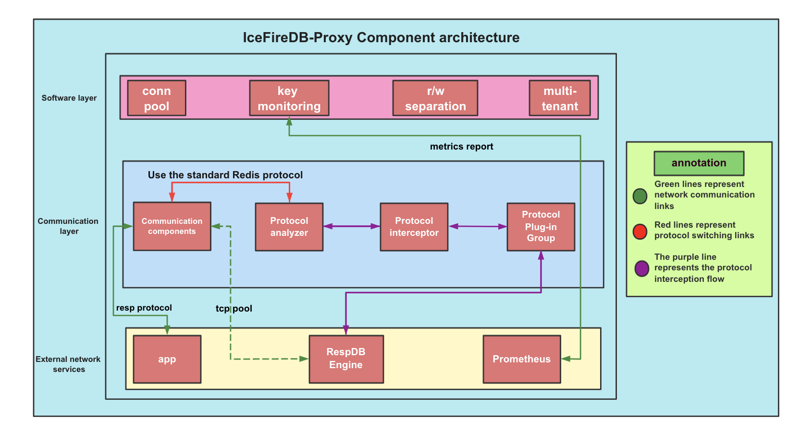

# IceFireDB-Proxy
[](https://github.com/IceFireDB/IceFireDB-Proxy/actions/workflows/main.yml) [](https://opensource.org/licenses/Apache-2.0) [](https://github.com/IceFireDB/IceFireDB-Proxy/blob/master/go.mod)

IceFireDB-Proxy is a high-performance, highly available, and user-friendly Resp protocol cluster proxy solution.

1. Complete data source mode support: stand-alone, cluster mode
2. Rich command support
3. Excellent cluster state management and failover
4. Excellent traffic control policies: Traffic read/write separation and multi-tenant data isolation
5. Excellent command telemetry features
6. Bottom-fishing use of mind and base abilities that are closer to cloud native
7. New framework for faster network, will be upgraded soon. [redhub](https://github.com/IceFireDB/redhub)

# Component Architecture


# Communication mode


## Table of Contents
- [Install](#Install)
- [Usage](#usage)
- [Command support](#command-support)
- [License](#license)


### Install
This project uses Go. Go check them out if you don't have them locally installed.
```text
1. Install Go
2. git clone https://github.com/IceFireDB/IceFireDB-Proxy.git $GOPATH/src/github.com/IceFireDB/IceFireDB-Proxy
3. cd $GOPATH/src/github.com/IceFireDB/IceFireDB-Proxy
4. make
```

### Usage
Run a binary file directly, if you need to run in the background can be added to the systemd system management
```shell
./bin/Icefiredb-proxy -c ./config/config.yaml
```

### Command support
#### String
* APPEND
* BITCOUNT
* BITPOS
* DECR
* DECRBY
* DEL
* EXISTS
* GET
* GETBIT
* SETBIT
* GETRANGE
* GETSET
* INCR
* INCRBY
* MGET
* MSET
* SET
* SETEX
* SETEXAT
* SETRANGE
* EXPIRE
* EXPIREAT
* TTL


#### Set
* SADD
* SCARD
* SETBIT
* SISMEMBER
* SMEMBERS
* SPOP
* SRANDMEMBER
* SREM
* SSCAN

#### List
* LINDEX
* LINSERT
* LLEN
* LPOP
* LPUSH
* LPUSHX
* LRANGE
* LREM
* LSET
* LTRIM
* RPOP
* RPUSH
* RPUSHX

#### Hash
* HDEL
* HEXISTS
* HGET
* HGETALL
* HINCRBY
* HINCRBYFLOAT
* HKEYS
* HLEN
* HMGET
* HMSET
* HSCAN
* HSET
* HSETNX
* HSTRLEN
* HVALS

#### Sorted Sets
* ZADD
* ZCARD
* ZCOUNT
* ZINCRBY
* ZLEXCOUNT
* ZPOPMAX
* ZPOPMIN
* ZLEXCOUNT
* ZRANGE
* ZRANGEBYLEX
* ZRANGEBYSCORE
* ZRANK
* ZREM
* ZREMRANGEBYLEX
* ZREMRANGEBYRANK
* ZREMRANGEBYSCORE
* ZREVRANGE
* ZREVRANGEBYLEX
* ZREVRANGEBYSCORE
* ZREVRANK
* ZSCAN
* ZSCORE

#### Stream
* XACK
* XADD
* XCLAIM
* XDEL
* XLEN
* XINFO
* XPENDING
* XRANGE
* XREADGROUP
* XREVRANGE
* XTRIM
* XGROUP


#### Others

* COMMAND
* PING
* QUIT

## License
Icefiredb-proxy is under the Apache 2.0 license. See the [LICENSE](./LICENSE) directory for details.

## Disclaimers
When you use this software, you have agreed and stated that the author, maintainer and contributor of this software are not responsible for any risks, costs or problems you encounter. If you find a software defect or BUG, ​​please submit a patch to help improve it!
